# Get Started with nflplotR

## Preface

Working with publicly available NFL data often results in a desire to
visualize the findings of one’s analyses (often in
[ggplot2](https://ggplot2.tidyverse.org)) and then publish these
visualizations. In team-level analyses, it appears that such
visualizations are more aesthetically pleasing when their logos are used
instead of team abbreviations. Another way to visually distinguish teams
is to use their primary or secondary team colors.

**nflplotR** provides ggplot2 extensions that greatly simplify these
tasks and avoid typical problems.

Long story short: the only thing that is required to use NFL team logos
or team colors in a ggplot is a variable in the plot data that holds
official NFL team abbreviations.

## Install the Package

The easiest way to get nflplotR is to install it from
[CRAN](https://cran.r-project.org/package=nflplotR) with:

``` r
install.packages("nflplotR")
```

To get a bug fix or to use a feature from the development version, you
can install the development version of nflplotR either from
[GitHub](https://github.com/nflverse/nflplotR/) with:

``` r
if (!require("pak")) install.packages("pak")
pak::pak("nflverse/nflplotR")
```

or prebuilt from the [development repo](https://nflverse.r-universe.dev)
with:

``` r
install.packages("nflplotR", repos = "https://nflverse.r-universe.dev")
```

## Typical Use Cases

Let’s look at some typical use cases for nflplotR using NFL play-by-play
data. In a first step we load all necessary packages.

``` r
library(nflplotR)
library(ggplot2)
library(gt)
library(nflreadr)
library(dplyr, warn.conflicts = FALSE)
options(nflreadr.verbose = FALSE)
```

We will load the data and compute each team’s offensive and defensive
EPA per play for the 2020 regular season. We will also compute the top
10 Quarterbacks in EPA per play.

``` r
pbp <- nflreadr::load_pbp(2020) |> 
  dplyr::filter(season_type == "REG") |>
  dplyr::filter(!is.na(posteam) & (rush == 1 | pass == 1))

offense <- pbp |>
  dplyr::group_by(team = posteam) |>
  dplyr::summarise(off_epa = mean(epa, na.rm = TRUE))

defense <- pbp |>
  dplyr::group_by(team = defteam) |>
  dplyr::summarise(def_epa = mean(epa, na.rm = TRUE))

combined <- offense |>
  dplyr::inner_join(defense, by = "team")

qbs <- pbp |>
  dplyr::filter(pass == 1 | rush == 1) |>
  dplyr::filter(down %in% 1:4) |>
  dplyr::group_by(id) |>
  dplyr::summarise(
    name = dplyr::first(name),
    team = dplyr::last(posteam),
    plays = dplyr::n(),
    qb_epa = mean(qb_epa, na.ram = TRUE)
  ) |>
  dplyr::filter(plays > 200) |>
  dplyr::slice_max(qb_epa, n = 10)
```

### Logos in Scatter Plots

Offensive and Defensive EPA per Play are typically used for NFL team
tiers. Let’s create this scatter plot and play around with the
capabilities of the logo geom.

``` r
ggplot2::ggplot(combined, aes(x = off_epa, y = def_epa)) +
  ggplot2::geom_abline(slope = -1.5, intercept = seq(0.4, -0.3, -0.1), alpha = .2) +
  nflplotR::geom_mean_lines(aes(x0 = off_epa , y0 = def_epa)) +
  nflplotR::geom_nfl_logos(aes(team_abbr = team), width = 0.065, alpha = 0.7) +
  ggplot2::labs(
    x = "Offense EPA/play",
    y = "Defense EPA/play",
    caption = "Data: @nflfastR",
    title = "2020 NFL Offensive and Defensive EPA per Play"
  ) +
  ggplot2::theme_minimal() +
  ggplot2::theme(
    plot.title = ggplot2::element_text(face = "bold"),
    plot.title.position = "plot",
    plot.background = ggplot2::element_rect(fill = "#F0F0F0")
  ) +
  ggplot2::scale_y_reverse()
```

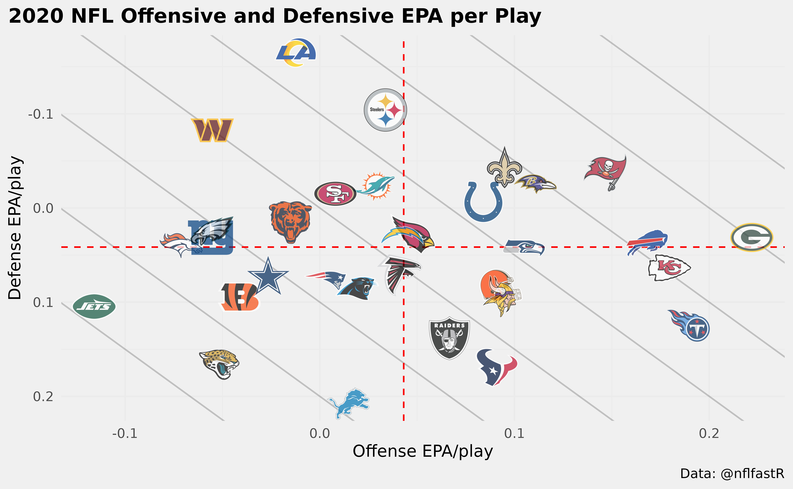

There is a lot going on here:

- we add mean lines for both x-axis and y-axis in a single line,
- we add team logos that are printed in correct aspect ratio regardless
  of plot dimensions and
- we add an alpha channel to the team logos (which can also be done
  inside an aesthetic which means it can differ for each team).

What if we would like to highlight just a few teams? Well, there are
multiple ways to do this. Either set the alpha channel for the
irrelevant teams lower or give them a color (or do both). Wait…a color?
Yes, it is possible to overwrite the color of logos but keep their
shape! Let’s do this in the next example. We would like to highlight the
NFC East Teams for no specific reason…

``` r
nfc_east <- c("DAL", "NYG", "PHI", "WAS")

combined |>
  dplyr::mutate(
    colour = ifelse(team %in% nfc_east, NA, "b/w"),
    alpha = ifelse(team %in% nfc_east, 0.9, 0.2)
  ) |>
  ggplot2::ggplot(aes(x = off_epa, y = def_epa)) +
  ggplot2::geom_abline(slope = -1.5, intercept = seq(0.4, -0.3, -0.1), alpha = .2) +
  nflplotR::geom_mean_lines(aes(x0 = off_epa , y0 = def_epa)) +
  nflplotR::geom_nfl_logos(aes(team_abbr = team, alpha = alpha, colour = colour), width = 0.065) +
  ggplot2::labs(
    x = "Offense EPA/play",
    y = "Defense EPA/play",
    caption = "Data: @nflfastR",
    title = "2020 NFL Offensive and Defensive EPA per Play"
  ) +
  ggplot2::scale_alpha_identity() +
  ggplot2::scale_color_identity() +
  ggplot2::theme_minimal() +
  ggplot2::theme(
    plot.title = ggplot2::element_text(face = "bold"),
    plot.title.position = "plot",
    plot.background = ggplot2::element_rect(fill = "#F0F0F0")
  ) +
  ggplot2::scale_y_reverse()
```

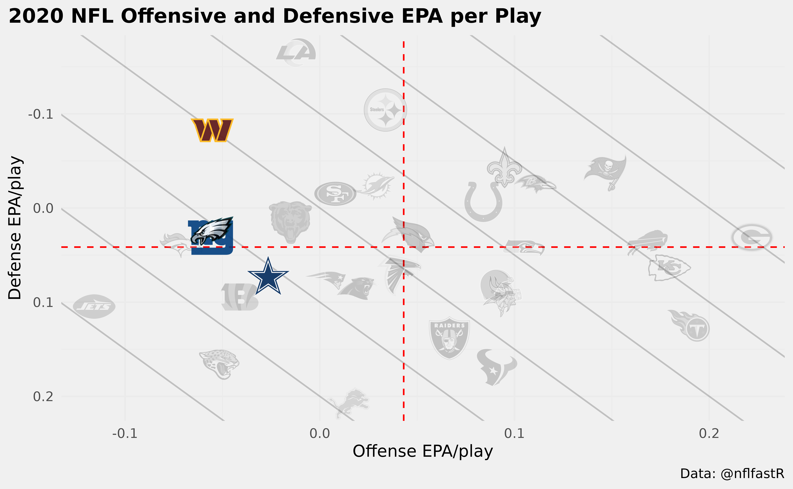

Please note the usage of the special color character `"b/w"` which sets
the colors to black and white and that we have to add
[`ggplot2::scale_alpha_identity()`](https://ggplot2.tidyverse.org/reference/scale_identity.html)
and
[`ggplot2::scale_color_identity()`](https://ggplot2.tidyverse.org/reference/scale_identity.html)
to our plot in case we are using alphas or colors as aesthetics because
we want to use the actual alpha and color values in our data set and not
some random defaults!

**This is just a small overview and it is recommended to check the
examples provided for each function.**

### Logos as Axis Labels

Let’s start with the offense and build a bar chart using logos as axis
labels and team colors as bar colors.

``` r
ggplot2::ggplot(offense, aes(x = team, y = off_epa)) +
  ggplot2::geom_col(aes(color = team, fill = team), width = 0.5) +
  nflplotR::scale_color_nfl(type = "secondary") +
  nflplotR::scale_fill_nfl(alpha = 0.4) +
  ggplot2::labs(
    title = "2020 NFL Offensive EPA per Play",
    y = "Offense EPA/play"
  ) +
  ggplot2::theme_minimal() +
  ggplot2::theme(
    plot.title = ggplot2::element_text(face = "bold"),
    plot.title.position = "plot",
    plot.background = ggplot2::element_rect(fill = "#F0F0F0"),
    # it's obvious what the x-axis is so we remove the title
    axis.title.x = ggplot2::element_blank(),
    # this line triggers the replacement of team abbreviations with logos
    axis.text.x.bottom = nflplotR::element_nfl_logo(size = 1)
  )
```

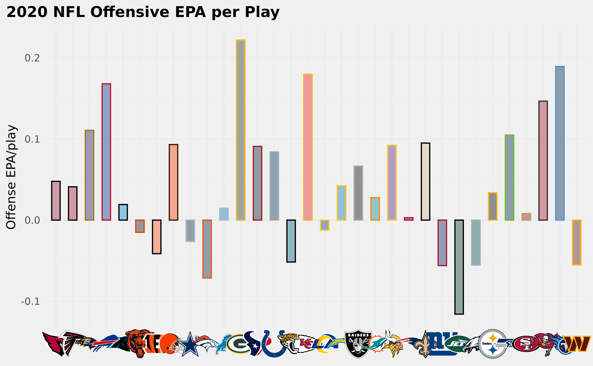

Some notes:

- color and fill allow primary or secondary team colors
- the axis labels are replaced with the logos by setting
  `axis.text.x.bottom = nflplotR::element_nfl_logo()` in the ggplot2
  theme call.

We can do the same thing for the y-axis (now with defensive EPA per
play). Let’s make them less intrusive by changing the color to black and
white

``` r
ggplot2::ggplot(defense, aes(y = team, x = def_epa)) +
  ggplot2::geom_col(aes(color = team, fill = team), width = 0.5) +
  nflplotR::scale_color_nfl(type = "secondary") +
  nflplotR::scale_fill_nfl(alpha = 0.4) +
  ggplot2::labs(
    title = "2020 NFL Defensive EPA per Play",
    x = "Defense EPA/play"
  ) +
  ggplot2::theme_minimal() +
  ggplot2::theme(
    plot.title = ggplot2::element_text(face = "bold"),
    plot.title.position = "plot",
    plot.background = ggplot2::element_rect(fill = "#F0F0F0"),
    # it's obvious what the y-axis is so we remove the title
    axis.title.y = ggplot2::element_blank(),
    # this line triggers the replacement of team abbreviations with logos
    axis.text.y.left = nflplotR::element_nfl_logo(color = "b/w", size = 1)
  )
```

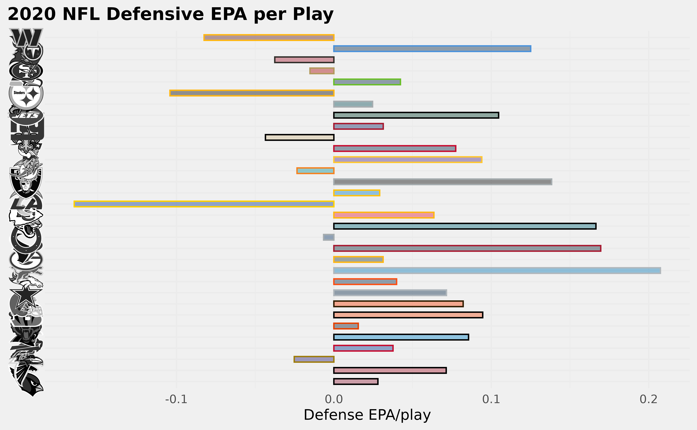

### Player Headshots as Axis Labels

Similar to the usage of team logos as axis labels, we can also use
player headshots. The only requirement is a valid NFL gsis ID as used in
the nflfastR play-by-play data.

``` r
ggplot2::ggplot(qbs, aes(x = reorder(id, -qb_epa), y = qb_epa)) +
  ggplot2::geom_col(aes(color = team, fill = team), width = 0.5) +
  nflplotR::scale_color_nfl(type = "secondary") +
  nflplotR::scale_fill_nfl(alpha = 0.4) +
  ggplot2::labs(
    title = "2020 NFL Quarterback EPA per Play",
    y = "EPA/play"
  ) +
  ggplot2::theme_minimal() +
  ggplot2::theme(
    plot.title = ggplot2::element_text(face = "bold"),
    plot.title.position = "plot",
    plot.background = ggplot2::element_rect(fill = "#F0F0F0"),
    # it's obvious what the x-axis is so we remove the title
    axis.title.x = ggplot2::element_blank(),
    # this line triggers the replacement of gsis ids with player headshots
    axis.text.x.bottom = nflplotR::element_nfl_headshot(size = 1)
  )
```

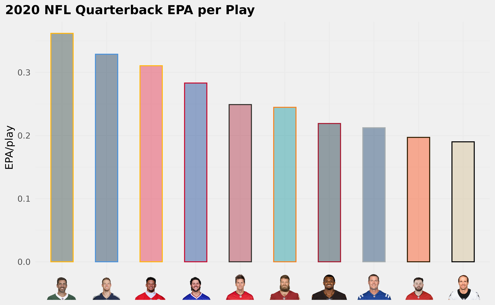

### Player Headshots in Scatter Plots

We can do the above example alternatively by putting the player image on
top of the columns and use team logos as axis labels instead.

``` r
ggplot2::ggplot(qbs, aes(x = reorder(team, -qb_epa), y = qb_epa)) +
  ggplot2::geom_col(aes(color = team, fill = team), width = 0.5) +
  nflplotR::geom_nfl_headshots(aes(player_gsis = id), width = 0.075, vjust = 0.45) +
  nflplotR::scale_color_nfl(type = "secondary") +
  nflplotR::scale_fill_nfl(alpha = 0.4) +
  ggplot2::labs(
    title = "2020 NFL Quarterback EPA per Play",
    y = "EPA/play"
  ) +
  ggplot2::ylim(0, 0.4) +
  ggplot2::theme_minimal() +
  ggplot2::theme(
    plot.title = ggplot2::element_text(face = "bold"),
    plot.title.position = "plot",
    plot.background = ggplot2::element_rect(fill = "#F0F0F0"),
    # it's obvious what the x-axis is so we remove the title
    axis.title.x = ggplot2::element_blank(),
    # this line triggers the replacement of team abbreviations with logos
    axis.text.x.bottom = nflplotR::element_nfl_logo(size = 1)
  )
```


## Let’s Play with Wordmarks and Other Images

The `theme_elements` presented above are more powerful than it seems at
first sight. We can replace text with NFL logos, NFL wordmarks, NFL
player headshots at every position, where ggplot can put text! And we
can do the same with literally every image url on the internet.

To show this, we create a dataframe of example data and add some nfl
team abbreviations and player gsis ids.

``` r
df <- mtcars |> 
  dplyr::mutate(
    team = sample(c("LAC", "BUF", "DAL", "ARI"), nrow(mtcars), TRUE),
    player = sample(c("00-0033873", "00-0035228", "00-0036355", "00-0019596"), nrow(mtcars), TRUE)
  )
```

Now we plot some of the data and facet by the team abbreviations.

``` r
ggplot(df, aes(x = mpg, y = disp)) +
  geom_point() +
  facet_wrap(vars(team)) +
  labs(
    title = tools::toTitleCase("These are random teams and data"),
    subtitle = "I just want to show how the nflplotR theme elements work",
    caption = "https://github.com/nflverse/nflseedR/raw/master/man/figures/caption.png"
  ) +
  theme_minimal() +
  theme(
    plot.title.position = "plot",
    plot.title = ggplot2::element_text(face = "bold"),
    plot.background = ggplot2::element_rect(fill = "#F0F0F0"),
    axis.title = element_blank()
  )
```

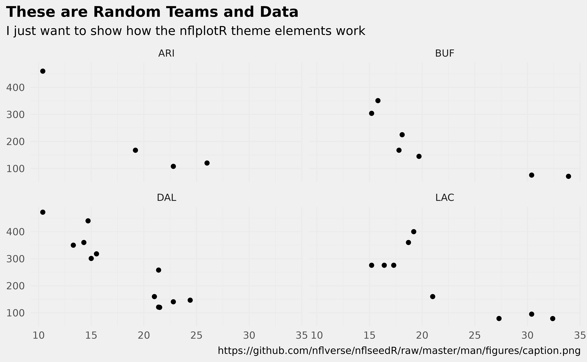

There are valid team names in the facet titles and there is an image url
in the caption. nflplotR can make images of these with two simple lines
in the [`theme()`](https://ggplot2.tidyverse.org/reference/theme.html)
call.

``` r
ggplot(df, aes(x = mpg, y = disp)) +
  geom_point() +
  facet_wrap(vars(team)) +
  labs(
    title = tools::toTitleCase("These are random teams and data"),
    subtitle = "I just want to show how the nflplotR theme elements work",
    caption = "https://github.com/nflverse/nflseedR/raw/master/man/figures/caption.png"
  ) +
  theme_minimal() +
  theme(
    plot.title.position = "plot",
    plot.title = ggplot2::element_text(face = "bold"),
    axis.title = element_blank(),
    plot.background = ggplot2::element_rect(fill = "#F0F0F0"),
    # make wordmarks of team abbreviations
    strip.text = nflplotR::element_nfl_wordmark(size = 1),
    # load image from url in caption
    plot.caption = ggpath::element_path(hjust = 1, size = 0.4)
  )
```

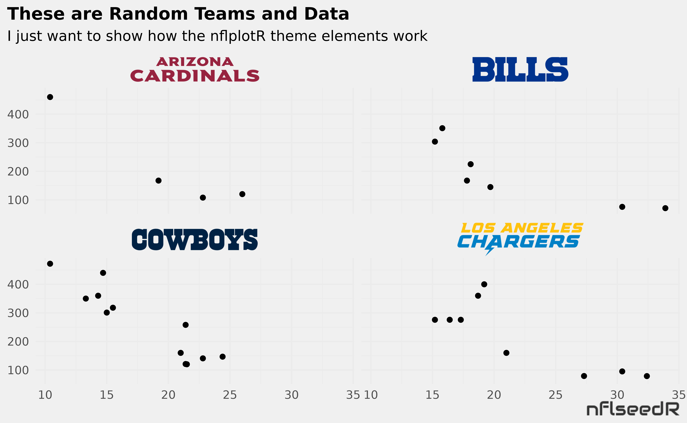

If you want logos instead of wordmarks…

``` r
ggplot(df, aes(x = mpg, y = disp)) +
  geom_point() +
  facet_wrap(vars(team)) +
  labs(
    title = tools::toTitleCase("These are random teams and data"),
    subtitle = "I just want to show how the nflplotR theme elements work",
    caption = "https://github.com/nflverse/nflseedR/raw/master/man/figures/caption.png"
  ) +
  theme_minimal() +
  theme(
    plot.title.position = "plot",
    plot.title = ggplot2::element_text(face = "bold"),
    axis.title = element_blank(),
    plot.background = ggplot2::element_rect(fill = "#F0F0F0"),
    # make wordmarks of team abbreviations
    strip.text = nflplotR::element_nfl_logo(size = 1),
    # load image from url in caption
    plot.caption = ggpath::element_path(hjust = 1, size = 0.4)
  )
```

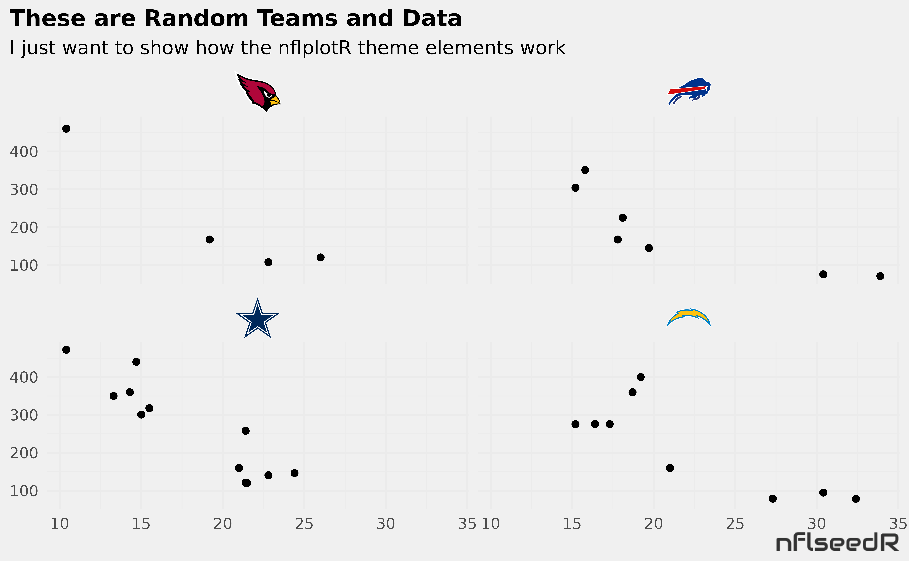

Or maybe facet by player and use headshots…

``` r
ggplot(df, aes(x = mpg, y = disp)) +
  geom_point() +
  facet_wrap(vars(player)) +
  labs(
    title = tools::toTitleCase("These are random players and data"),
    subtitle = "I just want to show how the nflplotR theme elements work",
    caption = "https://github.com/nflverse/nflseedR/raw/master/man/figures/caption.png"
  ) +
  theme_minimal() +
  theme(
    plot.title.position = "plot",
    plot.title = ggplot2::element_text(face = "bold"),
    axis.title = element_blank(),
    plot.background = ggplot2::element_rect(fill = "#F0F0F0"),
    # make wordmarks of team abbreviations
    strip.text = nflplotR::element_nfl_headshot(size = 1),
    # load image from url in caption
    plot.caption = ggpath::element_path(hjust = 1, size = 0.4)
  )
```

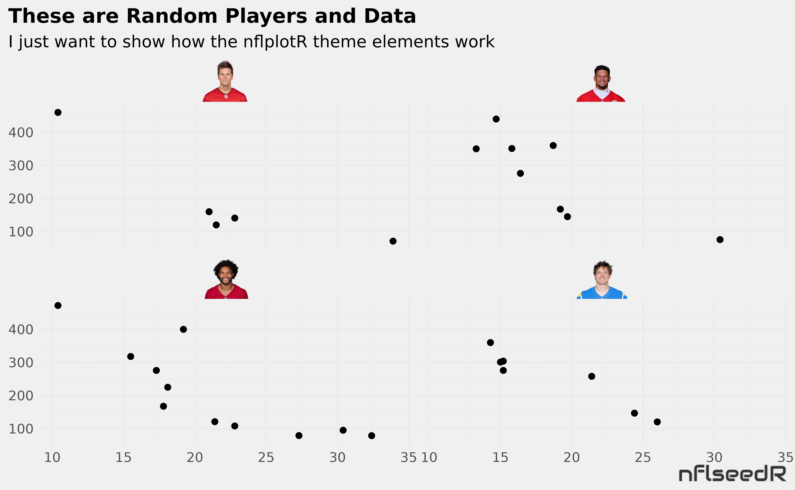

## Absolute Freedom in ggplot2

One thing is particularly hard to implement in ggplot, namely the free
arrangement of an image (e.g. your logo) somewhere in the plot. But with
the help of the powerful `theme_elements` it is possible!

All we need to do is assign the ggplot tag either an image URL or - in
terms of nflplotR - a team abbreviation or player gsis_id. Then we can
convert the tag with `theme_elements` in `plot.tag` into the
corresponding image and position it anywhere with `plot.tag.position`.

Let’s try a logo first:

``` r
ggplot(mtcars, aes(x = mpg, y = disp)) +
  geom_point() +
  labs(
    title = tools::toTitleCase("These are random data"),
    subtitle = "I just want to show how to place an NFL logo somewhere in the plot",
    tag = "LAC"
  ) +
  theme_minimal() +
  theme(
    plot.tag = nflplotR::element_nfl_logo(size = 2),
    plot.tag.position = c(0.5, 0.85),
    plot.background = ggplot2::element_rect(fill = "#F0F0F0")
  )
```

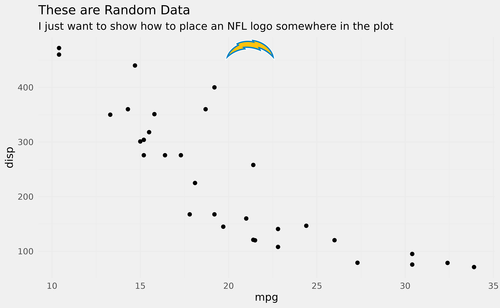

Looks even better with wordmarks:

``` r
ggplot(mtcars, aes(x = mpg, y = disp)) +
  geom_point() +
  labs(
    title = tools::toTitleCase("These are random data"),
    subtitle = "I just want to show how to place an NFL wordmark top right",
    tag = "LAC"
  ) +
  theme_minimal() +
  theme(
    plot.tag = nflplotR::element_nfl_wordmark(size = 5, hjust = 1, vjust = 1),
    plot.tag.position = c(1, 1),
    plot.background = ggplot2::element_rect(fill = "#F0F0F0")
  )
```

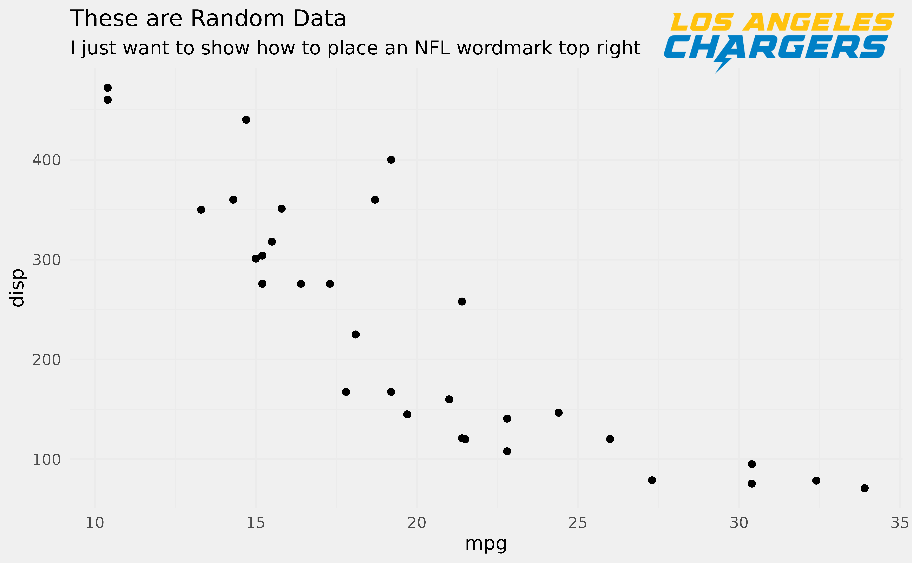

And we can do player headshots:

``` r
ggplot(mtcars, aes(x = mpg, y = disp)) +
  geom_point() +
  labs(
    title = tools::toTitleCase("These are random data"),
    subtitle = "I just want to show how to place player headshot top right",
    tag = "00-0036355"
  ) +
  theme_minimal() +
  theme(
    plot.tag = nflplotR::element_nfl_headshot(size = 5, hjust = 1, vjust = 1),
    plot.tag.position = c(1, 1),
    plot.background = ggplot2::element_rect(fill = "#F0F0F0")
  )
```


## nflplotR and the gt package

See `vignette("gt")`.

## How about speed in the RStudio preview pane?

If you are used to preview your plots in RStudio you will probably get a
bit impatient if a lot of logos have to be added to a plot because the
rendering can take a few seconds. This is what the nflplotR function
[`ggpreview()`](https://nflplotr.nflverse.com/reference/ggpreview.md) is
built for. It saves the plot in a temporary png file and previews it (in
it’s actual dimensions). Please see the function documentation for
further information.

## I Want this for College Football!

Fortunately, nflplotR was adapted for college football and released
under the name [cfbplotR](https://Kazink36.github.io/cfbplotR/).
