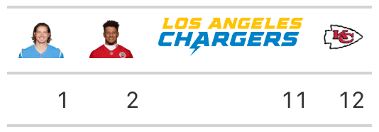

# Render Logos, Wordmarks, and Headshots in 'gt' Table Column Labels

Translate NFL team abbreviations into logos and wordmarks or NFL player
gsis IDs to player headshots and render these images in column labels of
'gt' tables.

## Usage

``` r
gt_nfl_cols_label(
  gt_object,
  columns = gt::everything(),
  ...,
  height = 30,
  type = c("logo", "wordmark", "headshot")
)
```

## Arguments

- gt_object:

  A table object that is created using the
  [`gt::gt()`](https://gt.rstudio.com/reference/gt.html) function.

- columns:

  The columns for which the image translation should be applied.
  Argument has no effect if `locations` is not `NULL`.

- ...:

  Currently not in use

- height:

  The absolute height (px) of the image in the table cell.

- type:

  One of `"logo"`, `"wordmark"`, or `"headshot"` selecting whether to
  render a team's logo or wordmark image, or a player's headshot.

## Value

An object of class `gt_tbl`.

## Output of below example



## See also

The article that describes how nflplotR works with the 'gt' package
<https://nflplotr.nflverse.com/articles/gt.html>

The logo and wordmark rendering functions
[`gt_nfl_logos()`](https://nflplotr.nflverse.com/reference/gt_nfl_logos.md)
and
[`gt_nfl_wordmarks()`](https://nflplotr.nflverse.com/reference/gt_nfl_logos.md).

The player headshot rendering function
[`gt_nfl_headshots()`](https://nflplotr.nflverse.com/reference/gt_nfl_headshots.md).

## Examples

``` r
# \donttest{
library(gt)
label_df <- data.frame(
  "00-0036355" = 1,
  "00-0033873" = 2,
  "LAC" = 11,
  "KC" = 12,
  check.names = FALSE
)

# create gt table and translate player IDs and team abbreviations
# into headshots, logos, and wordmarks
table <- gt::gt(label_df) |>
  nflplotR::gt_nfl_cols_label(
    columns = gt::starts_with("00"),
    type = "headshot"
  ) |>
  nflplotR::gt_nfl_cols_label("LAC", type = "wordmark") |>
  nflplotR::gt_nfl_cols_label("KC", type = "logo")
# }
```
