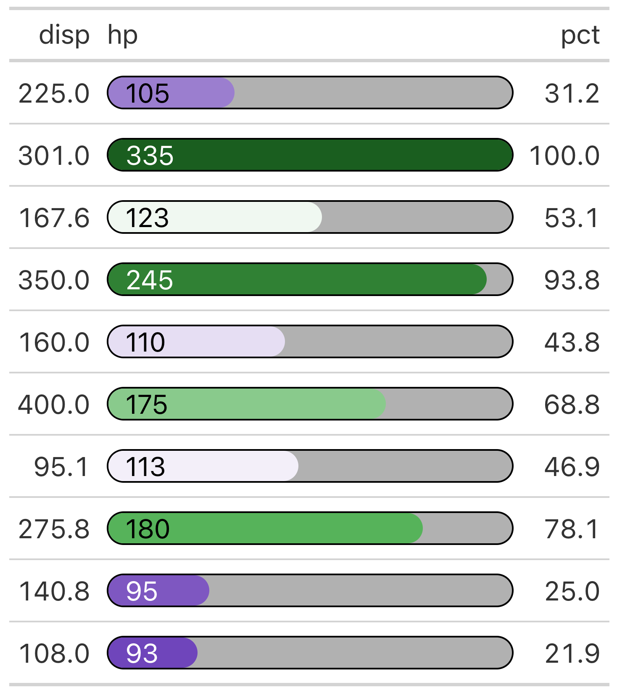

# Format Columns of 'gt' Tables as Percentage Bars

Add context to your data by adding a percentile bar to the actual
values. The percentile bar is colored with a color scale based on a user
supplied color palette and the relative width of the bars will be
rendered as tooltip.

## Usage

``` r
gt_pct_bar(
  gt_tbl,
  col_value,
  col_pct,
  ...,
  rows = gt::everything(),
  hide_col_pct = FALSE,
  value_position = c("inline", "above"),
  value_scale = 1L,
  value_padding_left = "0px",
  value_padding_right = "0px",
  value_colors = c("black", "white"),
  value_style.props = list(),
  fill_palette = "hulk",
  fill_palette.reverse = FALSE,
  fill_na.color = "#808080",
  fill_pct.domain = 0:100,
  fill_border.color = "transparent",
  fill_border.radius = "10px",
  fill_height = "100%",
  fill_style.props = list(),
  background_border.color = "thin solid black",
  background_border.radius = "12px",
  background_fill.color = "#b1b1b1",
  background_fill.width = "100%",
  background_fill.height = "100%",
  background_style.props = list()
)
```

## Arguments

- gt_tbl:

  A table object that is created using the
  [`gt::gt()`](https://gt.rstudio.com/reference/gt.html) function.

- col_value:

  Column name of the value to be printed.

- col_pct:

  Column name of percentage values controlling the fill width. If this
  is not in a 0 - 100 range, use `value_scale` to scale it up.

- ...:

  These dots are for future extensions and must be empty.

- rows:

  *Rows to target*

  `<row-targeting expression>` // *default:*
  [`everything()`](https://tidyselect.r-lib.org/reference/everything.html)

  In conjunction with `columns`, we can specify which of their rows
  should form a constraint for extraction. The default
  [`everything()`](https://tidyselect.r-lib.org/reference/everything.html)
  results in all rows in `columns` being formatted. Alternatively, we
  can supply a vector of row IDs within
  [`c()`](https://rdrr.io/r/base/c.html), a vector of row indices, or a
  select helper function (e.g.
  [`starts_with()`](https://tidyselect.r-lib.org/reference/starts_with.html),
  [`ends_with()`](https://tidyselect.r-lib.org/reference/starts_with.html),
  [`contains()`](https://tidyselect.r-lib.org/reference/starts_with.html),
  [`matches()`](https://tidyselect.r-lib.org/reference/starts_with.html),
  [`num_range()`](https://tidyselect.r-lib.org/reference/starts_with.html),
  and
  [`everything()`](https://tidyselect.r-lib.org/reference/everything.html)).
  We can also use expressions to filter down to the rows we need (e.g.,
  `[colname_1] > 100 & [colname_2] < 50`).

- hide_col_pct:

  If `TRUE`, the column in `col_pct` will be hidden in the resulting
  table.

- value_position:

  One of the following:

  - `"inline"` : prints the value inside of the bars

  - `"above"` : prints the value above the bars

- value_scale:

  A scaling factor: values from column `col_pct` will be multiplied by
  `value_scale` before proceeding. This is useful if the underlying data
  is in a 0 - 1 range, instead of the required 0 - 100 range.

- value_padding_left:

  Left padding of the printed text.

- value_padding_right:

  Right padding of the printed text.

- value_colors:

  One or more colors of the printed text. If this is a vector of colors
  and `value_position = "inline"`, the function will calculate color
  contrast ratios with
  [colorspace::contrast_ratio](https://colorspace.R-Forge.R-project.org/reference/contrast_ratio.html)
  and, based on this, decide which of the colors to chose to maximize
  readability. You can overwrite the resulting colos with
  `value_style.props`. NOTE: this uses colors from `fill_palette` for
  contrast ratio calculations and not from `background_fill.color`
  because it is not trivial to figure out the actual background of the
  text (it could overlap with both).

- value_style.props:

  A named list of the form `list(property = value)` for enhanced control
  of the html style property. This can overwrite the default properties
  set with the above `value_` arguments.

- fill_palette:

  The colors that values will be mapped to. This can also be one of
  `"hulk"`, `"hulk_teal"`, or `"blue_orange"` which will trigger
  internal color palettes. Argument passed on to
  [scales::col_numeric](https://scales.r-lib.org/reference/col_numeric.html).

- fill_palette.reverse:

  Whether the vector of colors in `fill_palette` should be reversed.
  Argument passed on to
  [scales::col_numeric](https://scales.r-lib.org/reference/col_numeric.html).

- fill_na.color:

  Fill color in case of `NA` values. Argument passed on to
  [scales::col_numeric](https://scales.r-lib.org/reference/col_numeric.html).

- fill_pct.domain:

  The possible values that colors in `fill_palette` can be mapped to.

- fill_border.color:

  Border color of color filled area.

- fill_border.radius:

  Border radius of color filled area.

- fill_height:

  The height of the colored fill bar. Should correspond with
  `background_fill.height`. This defaults to 100% which will make sure
  the bar height matches text size of the printed value (when
  `value_position = "inline"`). Please note that
  `value_position = "inline"` requires an absolute value of
  `fill_height`, (e.g. `5px`), otherwise it will render as line.

- fill_style.props:

  A named list of the form `list(property = value)` for enhanced control
  of the html style property. This can overwrite the default properties
  set with the above `fill_` arguments.

- background_border.color:

  Border color of background.

- background_border.radius:

  Border radius of background.

- background_fill.color:

  Fill color of background.

- background_fill.width:

  Width of background.

- background_fill.height:

  The height of the colored background bar. Should correspond with
  `fill_height`. This defaults to 100% which will make sure the bar
  height matches text size of the printed value (when
  `value_position = "inline"`). Please note that
  `value_position = "inline"` requires an absolute value of
  `background_fill.height`, (e.g. `5px`), otherwise it will render as
  line.

- background_style.props:

  A named list of the form `list(property = value)` for enhanced control
  of the html style property. This can overwrite the default properties
  set with the above `background_` arguments.

## Value

An object of class `gt_tbl`.

## Details

The function allows extensive styling of the bars and text, either by
using some of the default arguments or, if you want full control, by
using the `*_style.props` lists which give you full control over all
style properties. All styling parameters are interpreted as style
properties of a html span tag. For more information on CSS properties,
see <https://www.w3schools.com/cssref/index.php>.

### Some notes about styling

Since this is meant to be an extension of an already existing 'gt'
table, you'll have to do some styling outside of this function, esp. the
horizontal alignment and direction will be controlled by
[`gt::cols_align`](https://gt.rstudio.com/reference/cols_align.html)
(see example).

Make sure to play around with `fill_border.radius` and
`background_border.radius`. Results will depend on final column width
and percentiles. Very short percentile bars, i.e. small values in
`col_pct`, might result in bars crossing the border when combined with a
big border radius.

Text alignment depending on the colored bar isn't as easy as one might
think. Try percent values in `value_padding_left` or
`value_padding_right` to avoid overlapping of text values and the
outline of the colored bars.

For more information and examples, see the article that describes how
nflplotR works with the 'gt' package
<https://nflplotr.nflverse.com/articles/gt.html>.

## Output of below example



## See also

The article that describes how nflplotR works with the 'gt' package
<https://nflplotr.nflverse.com/articles/gt.html>

## Examples

``` r
library(data.table)

# Make a data.table of mtcars and select only disp and hp
data <- data.table::as.data.table(mtcars)[, list(disp, hp)]

# Add the percentile of hp in the distribution of hp values
data[, pct := round(stats::ecdf(hp)(hp) * 100, 1)]
#>      disp    hp   pct
#>     <num> <num> <num>
#>  1: 160.0   110  43.8
#>  2: 160.0   110  43.8
#>  3: 108.0    93  21.9
#>  4: 258.0   110  43.8
#>  5: 360.0   175  68.8
#>  6: 225.0   105  31.2
#>  7: 360.0   245  93.8
#>  8: 146.7    62   6.2
#>  9: 140.8    95  25.0
#> 10: 167.6   123  53.1
#> 11: 167.6   123  53.1
#> 12: 275.8   180  78.1
#> 13: 275.8   180  78.1
#> 14: 275.8   180  78.1
#> 15: 472.0   205  81.2
#> 16: 460.0   215  84.4
#> 17: 440.0   230  87.5
#> 18:  78.7    66  15.6
#> 19:  75.7    52   3.1
#> 20:  71.1    65   9.4
#> 21: 120.1    97  28.1
#> 22: 318.0   150  59.4
#> 23: 304.0   150  59.4
#> 24: 350.0   245  93.8
#> 25: 400.0   175  68.8
#> 26:  79.0    66  15.6
#> 27: 120.3    91  18.8
#> 28:  95.1   113  46.9
#> 29: 351.0   264  96.9
#> 30: 145.0   175  68.8
#> 31: 301.0   335 100.0
#> 32: 121.0   109  34.4
#>      disp    hp   pct

# set seed to keep it reproducible
set.seed(20)

# take random sample (to avoid a big table) and add the percent bars for hp
# using the percentiles in the pct variable
table <- data[sample(.N, 10)] |>
  gt::gt() |>
  nflplotR::gt_pct_bar(
    "hp", "pct",
    hide_col_pct = FALSE,
    value_padding_left = "10px",
  ) |>
  gt::cols_align("left", hp) |>
  gt::cols_width(hp ~ gt::px(250))
```
